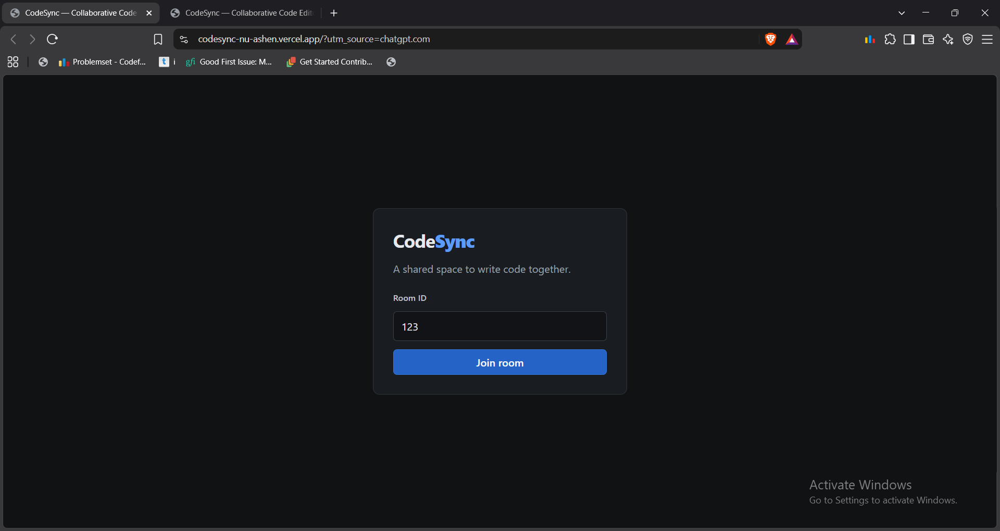
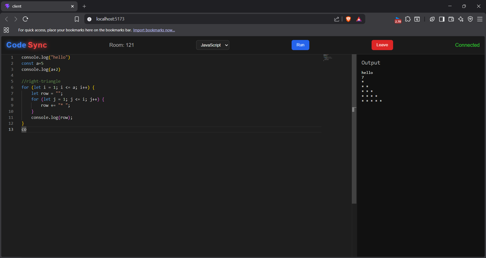

# ⚡ CodeSync

### Real-time collaborative code editor built with React, TypeScript, Monaco Editor, WebSockets, and Judge0.

[](https://codesync-nu-ashen.vercel.app/)
[](https://vercel.com/)
[](https://render.com/)
[](https://www.typescriptlang.org/)
[](https://react.dev/)
[](https://developer.mozilla.org/en-US/docs/Web/API/WebSockets_API)

> **Write code together. See changes instantly. Run it safely.**

CodeSync is a browser-based collaborative code editor where multiple users can join the same room, edit a shared Monaco document, see remote cursor positions, and execute code through the Judge0 sandbox API.

---

## 🌐 Live Demo

### 🚀 Try CodeSync

**https://codesync-nu-ashen.vercel.app/**

Open the application in two browser tabs, join the same room, and start editing.

### 💻 Source Code

**https://github.com/sinjaa18/codesync**

---

## ✨ Features

| Feature | Description |
|---|---|
| 🏠 Room-based collaboration | Join a shared workspace using a room ID |
| ⚡ Real-time editing | Code changes are synchronized through WebSockets |
| 🎯 Cursor sharing | Remote cursor positions are synchronized between participants |
| 👥 Presence | Shows the number of connected participants |
| 🧑‍💻 Monaco Editor | Full editor experience with syntax highlighting |
| 🌐 Multi-language | JavaScript, TypeScript, Python, C++, and Java |
| ▶️ Code execution | Execute code through Judge0 Community Edition |
| 🔄 Reconnection handling | Detects closed connections and allows reconnecting |
| 📋 Room sharing | Copy a room ID to invite another participant |
| 🛡️ Server-side validation | Execution requests are validated before submission |
| 🚫 No unsafe execution | User code is never evaluated inside the CodeSync server |

---

## 🖥️ Screenshots

### Join a Room



### Collaborative Editor



---

## 🏗️ Architecture

```text
                         CodeSync
                            │
             ┌──────────────┴──────────────┐
             │                             │
             ▼                             ▼
      React + Monaco                  REST API
             │                             │
             │ WebSocket                  │ POST /run
             ▼                             ▼
      Node.js + Express                Judge0 API
             │
             │
             ▼
      ws WebSocket Server
             │
             ▼
      In-Memory Room State
```

### Collaboration Flow

```text
User A
  │
  │ doc-update (Yjs)
  ▼
WebSocket Server
  │
  ├── update room state
  │
  └── broadcast to other members
              │
              ▼
            User B
```

### Code Execution Flow

```text
Browser
   │
   │ POST /run
   ▼
Express Server
   │
   │ validate request
   ▼
Judge0
   │
   │ sandboxed execution
   ▼
Execution Result
   │
   ▼
Browser Output Panel
```

---

## ⚡ How Realtime Collaboration Works

CodeSync uses a simple room-based WebSocket architecture.

When a user joins a room:

```text
Client
  ↓
join(roomId)
  ↓
Server registers socket
  ↓
Current room state returned
  ↓
Collaborative editing begins
```

CodeSync uses Yjs shared text and its Monaco binding. Editors exchange incremental document updates over the existing WebSocket room connection. Yjs merges concurrent edits; the server applies each update to the room document and relays it to the other participants.

When a client joins, it sends a Yjs state vector. The server responds with the missing document update and its current state vector, allowing the client to reconcile offline edits after a reconnect.

When code changes:

```text
Monaco Editor + Yjs binding
     ↓
incremental Yjs update
     ↓
doc-update
     ↓
WebSocket server
     ↓
apply update to the room Y.Doc
     ↓
broadcast to other users
```

Cursor movement follows a similar WebSocket event flow.

Remote code updates are applied to the shared Yjs document without echoing them back to the server.

### Room State

```text
Room ID
   │
   ├── connected sockets
   └── latest code
```

When the last participant leaves, the room state is removed from memory.

---

## 🧠 Engineering Decisions

### Why WebSockets?

HTTP is useful for request/response operations such as code execution, but collaboration requires continuous bidirectional communication.

CodeSync therefore uses:

```text
WebSocket → realtime collaboration
HTTP      → code execution
```

### Why Yjs?

Yjs provides conflict-free merging for concurrent text edits and compact incremental updates. It keeps client documents reconcilable after temporary disconnects while using the existing WebSocket transport.

This keeps the system small and understandable while demonstrating the fundamentals of:

- WebSocket communication
- room membership
- event broadcasting
- shared state
- remote editor updates
- connection lifecycle management

### Why Not `eval()`?

Executing arbitrary user code directly inside the application server would be unsafe.

Instead:

```text
CodeSync Server
      │
      ▼
Judge0 Sandbox
      │
      ▼
User Program
```

The CodeSync backend never evaluates submitted source code itself.

---

## ▶️ Supported Languages

```text
JavaScript
TypeScript
Python
C++
Java
```

Code execution is handled by the configured Judge0 Community Edition service.

The exact compiler/runtime version and public availability depend on the selected Judge0 host.

---

## 🔐 Security Considerations

CodeSync is designed as a learning and portfolio-scale collaborative editor rather than a production-grade multi-tenant IDE.

Current protections include:

- Zod request validation
- server-side execution request validation
- external sandbox execution through Judge0
- bounded source/runtime settings
- configurable allowed frontend origin
- no direct server-side `eval()` or dynamic execution

### Important

The public deployment does **not** provide authentication or room-level authorization.

Room IDs are currently the access mechanism.

A production-grade version could add:

```text
Authentication
      ↓
Authorized room membership
      ↓
Persistent storage
      ↓
Distributed rate limiting
      ↓
Stronger execution isolation
```

---

## 🧪 Verification

Run the local collaboration integration test with:

```bash
cd server
npm test
```

It checks concurrent edits, late joins, room isolation, cursor events, disconnect cleanup, and reconnect reconciliation. It reports loopback update latency for one local run; those measurements are indicative and are not a load test.

Other deployment and Judge0 checks below reflect prior project verification and are not part of this collaboration integration test.

Verified functionality includes:

- frontend production build
- backend TypeScript build
- WebSocket connection establishment
- room joining
- participant counts
- concurrent Yjs code synchronization
- cursor synchronization
- room isolation
- late-join code snapshots
- malformed and invalid room messages
- disconnect cleanup
- Judge0 code execution
- production `/run` API
- production frontend/backend communication
- local collaboration integration test

The production frontend is deployed on Vercel and the backend on Render.

---

## 🛠️ Tech Stack

### Frontend

- React
- TypeScript
- Vite
- Monaco Editor
- Yjs
- `y-monaco`

### Backend

- Node.js
- TypeScript
- Express
- `ws`
- Zod

### Code Execution

- Judge0 Community Edition API

### Deployment

- Vercel
- Render

---

## 📁 Project Structure

```text
CodeSync/
│
├── client/
│   ├── src/
│   │   ├── App.tsx
│   │   ├── main.tsx
│   │   └── ...
│   ├── .env.example
│   ├── package.json
│   └── vite.config.ts
│
├── server/
│   ├── src/
│   │   └── index.ts
│   ├── .env.example
│   ├── package.json
│   └── tsconfig.json
│
├── screenshots/
│   ├── join-room.png
│   └── editor-output.png
│
├── .gitignore
└── README.md
```

---

## 🚀 Local Development

### Prerequisites

- Node.js 22.12+
- npm

### 1. Clone

```bash
git clone https://github.com/sinjaa18/codesync.git
cd codesync
```

### 2. Start the Backend

```bash
cd server
npm install
cp .env.example .env
npm run dev
```

On PowerShell:

```powershell
Copy-Item .env.example .env
```

### 3. Start the Frontend

Open another terminal:

```bash
cd client
npm install
cp .env.example .env
npm run dev
```

On PowerShell:

```powershell
Copy-Item .env.example .env
```

Open:

```text
http://localhost:5173
```

Open the application in two browser tabs and join the same room.

---

## ⚙️ Environment Variables

### Client

`client/.env.example`

```env
VITE_API_URL=http://localhost:5000
VITE_WS_URL=ws://localhost:5000
```

Production values:

```env
VITE_API_URL=https://codesync-7qiq.onrender.com
VITE_WS_URL=wss://codesync-7qiq.onrender.com
```

These values are exposed to the browser and should therefore contain only public service URLs.

### Server

`server/.env.example`

```env
PORT=5000
CLIENT_ORIGIN=http://localhost:5173
JUDGE0_API_URL=https://ce.judge0.com
JUDGE0_AUTH_TOKEN=
```

The Judge0 token is optional and depends on the configured Judge0 provider.

Never commit real secrets.

---

## 📡 API

### Health Check

```http
GET /
```

Response:

```text
CodeSync server is running.
```

### Execute Code

```http
POST /run
```

Example request:

```json
{
  "language": "javascript",
  "code": "console.log('Hello CodeSync')"
}
```

The server validates the request and submits it to Judge0.

---

## 🔌 WebSocket Events

The collaboration protocol uses a small set of events:

```text
join (includes Yjs state vector)
joined (includes Yjs update and state vector)
doc-update (incremental Yjs update)
cursor-update
users (participant count)
user-left
```

The server returns the update missing from the joining client's state vector. Room documents are held in memory and are deleted when the last participant leaves.

---

## ⚠️ Current Limitations

CodeSync intentionally keeps the architecture simple.

### Collaboration

Yjs merges concurrent text edits. Room documents remain in process memory; they are not persisted after the last participant leaves or a server restart.

### Persistence

Room state exists only in server memory.

A server restart removes active rooms and their code.

### Authentication

There is currently no authentication or authorization system.

### Scaling

The current room state is process-local and designed for a single server instance.

### Presence

Only participant count and a single remote cursor are currently represented.

### Execution

Code execution depends on the configured external Judge0 service and its availability and rate limits.

---

## 🗺️ Future Improvements

```text
Current
  │
  ├── In-memory rooms
  ├── Yjs conflict-free synchronization
  ├── No authentication
  └── Single server instance
        │
        ▼
Next
  │
  ├── Authentication
  ├── Persistent rooms
  ├── Per-user cursor presence
  ├── Better conflict handling
  └── Rate limiting
        │
        ▼
Future
  │
  ├── Persistent room history
  ├── Redis-based distributed presence
  ├── Multi-instance WebSocket scaling
  ├── Persistent project/workspace storage
  └── Collaborative project management
```

---

## 💡 What This Project Demonstrates

CodeSync demonstrates practical understanding of:

- WebSocket communication
- event-driven server architecture
- CRDT-based realtime state synchronization
- connection lifecycle management
- room-based session management
- Monaco Editor integration
- REST + WebSocket architecture
- API validation with Zod
- external sandboxed code execution
- frontend/backend deployment
- production environment configuration
- debugging and production verification

---

## 🎯 Demo Scenario

```text
1. Open CodeSync
        ↓
2. Join a room
        ↓
3. Open the same room in another tab
        ↓
4. Start typing
        ↓
5. Watch changes synchronize
        ↓
6. Move the cursor
        ↓
7. Observe participant presence
        ↓
8. Run the code
        ↓
9. View execution output
```

---

## 📌 Project Status

**Status: Deployed and functional**

| Component | Platform |
|---|---|
| Frontend | Vercel |
| Backend | Render |
| Realtime Transport | WebSocket |
| Code Execution | Judge0 Community Edition |

---

## 👨‍💻 Author

**Sintu Kumar**

B.Tech CSE — NIT Agartala

GitHub:  
https://github.com/sinjaa18

---

## 📄 License

This project is a personal learning and portfolio project.
