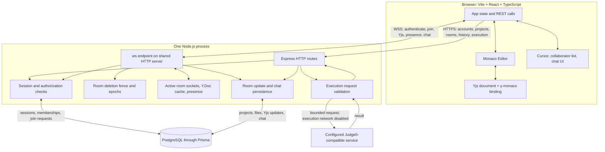

# CodeSync architecture

This document describes the current implementation in the repository. The HTTP API and WebSocket endpoint are hosted by the same Node.js server process. PostgreSQL stores durable product and collaboration data; active socket membership, presence, Yjs document instances, and request/event listeners are process-local.

## Components and data paths

The browser API and WebSocket origins are configured independently with VITE_API_URL and VITE_WS_URL. The server uses CLIENT_ORIGIN for allowed browser origins. The WebSocket server is attached to the same Node HTTP server as Express, so the backend service must support HTTP upgrade requests.

## Authentication and authorization boundary

### HTTP sessions

Signup and login validate credentials and create an opaque random bearer token. It is not a JWT. The server hashes the token with SHA-256 for its database session key and sets a one-hour expiry. Protected routes look up the current session on each HTTP request. Logout deletes the session and notifies listeners in the local process.

Passwords are hashed with scrypt. Authentication attempts are limited by a process-local IP counter.

### WebSocket lifecycle

1. The client opens a WebSocket and sends an authenticate message containing its bearer token.
2. The backend looks up the session, associates the socket with the user, and sets a timer for session expiry.
3. The client sends join with a room ID and optional Yjs state vector.
4. Before sending room content, the server checks access in PostgreSQL. A direct room membership grants access. Without that room-level membership, project-room access is granted to OWNER and EDITOR project roles. A VIEWER can read project file data through the project HTTP route, but the VIEWER role alone does not grant room access.
5. Each subsequent room message is associated with the authenticated socket membership. The client cannot choose its own user identity for persisted chat or presence.

Session revocation and project membership revocation close matching sockets through listeners in this process. They do not publish to other backend instances.

### Project and room requests

Project owners invite project members and approve or reject project join requests. An approved project join request creates EDITOR membership. For standalone rooms, the room owner controls room invitations and room join requests. A request alone grants no read, chat, or WebSocket access; approval writes membership to PostgreSQL, after which the requester can join.

Room IDs are identifiers, not bearer secrets. The API requires an authenticated user and the relevant membership before returning room chat or collaborative state.

## HTTP API surface

| Method and path | Authentication | Purpose and authorization |
| --- | --- | --- |
| GET /, GET /health, GET /ready | Public | Informational response, process liveness, and PostgreSQL readiness. |
| POST /auth/signup, POST /auth/login | Public | Create an account or session. |
| POST /auth/logout, GET /auth/me | Session | Revoke the current session or return the current user. |
| GET /projects, POST /projects | Session | List the caller’s projects or create a project. |
| GET /projects/:projectId/files | Project member | List file metadata and content; project viewers have read access. |
| POST /projects/:projectId/files, PATCH or DELETE /projects/:projectId/files/:fileId | Project OWNER or EDITOR | Create, rename, or delete a file and its collaboration room. |
| POST /projects/:projectId/invites, DELETE /projects/:projectId/invites/:username | Project owner | Invite or revoke a project member. |
| GET /projects/:projectId/requests, POST /projects/:projectId/requests/:username/approve, DELETE /projects/:projectId/requests/:username | Project owner | Review project join requests. Approval assigns EDITOR membership. |
| DELETE /projects/:projectId | Project owner | Delete the project and its rooms and dependent records. |
| POST /rooms/:roomId/access, POST /rooms/:roomId/invites | Session; invite requires room owner | Create or access an authorized room, or grant a room-level membership. |
| POST /rooms/:roomId/requests, GET /rooms/:roomId/requests/status | Session | Request access or recover the caller’s pending/approved status. |
| GET /rooms/:roomId/requests, POST /rooms/:roomId/requests/:username/approve, DELETE /rooms/:roomId/requests/:username | Room owner | Review standalone room join requests. |
| GET /rooms/:roomId/messages | Room member | Read the latest 100 authorized room chat messages. |
| GET /run/languages | Public | Return configured language choices. |
| POST /run | Session | Validate and submit code to the configured Judge0 service. |

All project and room routes require a valid session. Project file reads permit any project membership role; file mutations require OWNER or EDITOR. A direct room membership is a separate access grant from project role.

## WebSocket message summary

The client authenticates with authenticate and waits for authenticated before sending join. The join message includes the room ID and may include a Yjs state vector; joined returns the missing document update, state vector, and participant count. The server then sends presence-state.

| Message | Direction | Meaning |
| --- | --- | --- |
| authenticate / authenticated | Client to server / server to client | Establish an authenticated socket session. |
| join / joined | Client to server / server to client | Authorize room membership and exchange Yjs state. |
| doc-update | Both | Send or relay an incremental Yjs update. |
| presence-update, presence-state, presence-remove | Both | Exchange cursor and collaborator presence. |
| users, user-left | Server to client | Report room participant counts and departures. |
| chat-send / chat-message | Client to server / server to client | Persist and broadcast an authorized room message. |
| join-request, request-approved, request-rejected | Server to client | Notify an owner or requester about join-request state. |
| error | Server to client | Report protocol, authentication, or room-access failures. |

The authenticated socket supplies the author identity. Room access is rechecked when joining, and later messages are bound to the server-side membership recorded for that socket.

## Yjs synchronization and persistence

Each project file is associated with a room and a Yjs document. Standalone rooms use the same document mechanism.

- On join, the client sends a Yjs state vector.
- The backend loads the room’s DocumentUpdate records in sequence into a Y.Doc, or reuses a cached document while active sockets remain.
- The server returns the missing Yjs state and current state vector.
- A client edit is sent as an incremental Yjs update. The server applies it to its Y.Doc, persists the update, updates the room timestamp and project file text in a database transaction, and broadcasts the update to other sockets in that room.
- On final disconnect, the in-memory Y.Doc is destroyed. The ordered update log remains in PostgreSQL and is replayed on the next join.

Updates are append-only; compaction and document history browsing are not implemented.

This is server-backed reconnect recovery, not an offline sync service. Yjs can merge concurrent local edits, but clients need to reconnect to the backend to exchange state and persist new work.

Chat messages are persisted in PostgreSQL with a client message ID for idempotent retries. The API loads a bounded recent history for an authorized room; accepted live messages are broadcast to its authorized sockets.

## Room deletion lifecycle

File deletion and project deletion use the room lifecycle service. A room deletion begins by invalidating its current epoch and marking the room as deleting. While the fence is active, new access checks and joins are rejected. Existing sockets are closed and removed from process-local presence and room membership; cached Yjs documents, pending document loads, and queued persistence references are evicted.

Database operations already authorized for the room are drained before the room rows are removed. An in-flight document load checks its captured epoch before it can be installed in the cache; a result from an invalidated epoch is destroyed. Once deletion completes, reusing the same room ID captures a new epoch and loads only the new database state.

Project deletion applies the lifecycle fence to each project room before the database transaction removes project data. This protects both a room deleted with its file and rooms removed as part of project deletion. Coordination is process-local and assumes one backend instance.

## Durable data versus process state

| Durable in PostgreSQL | Process-local |
| --- | --- |
| Password salt and hash; session hash and expiry | Open WebSocket connections |
| Project membership and join requests | Room socket sets and active membership objects |
| Project files and current file text | Presence and cursor snapshots |
| Room membership and ordered Yjs updates | Active Y.Doc cache and pending loads |
| Chat messages | Rate-limit counters and event listeners |

The Prisma schema and migrations define indexes for session expiry, project/room membership lookup, and ordered per-room update replay.

Health reports process liveness. Readiness also checks PostgreSQL and returns service-unavailable if the database check fails.

## Operational diagnostics

The server writes structured one-line JSON events to standard output. HTTP responses include X-Request-ID; valid UUID v4 request IDs are reused, and other supplied values are replaced. Use the response ID when correlating an HTTP failure with server logs. The /health and /ready routes report process and database status without exposing configuration details. The repository does not include a hosted metrics, tracing, or log aggregation service.

## Execution boundary

The authenticated POST /run route validates source, language, and standard input, applies a per-user process-local rate limit, and sends a bounded request to the configured Judge0 service. The server supplies resource limits, disables execution network access, bounds upstream response bytes and total request time, and truncates returned output. The application server does not evaluate submitted source code. Source and standard input are sent to the configured external execution provider.

## Operational implications

- Run one backend instance for the current process-local WebSocket state, broadcasts, rate limits, and prompt revocation behavior.
- Configure a persistent PostgreSQL database through DATABASE_URL; apply Prisma migrations with npm --prefix server run db:deploy.
- Set CLIENT_ORIGIN, VITE_API_URL, and VITE_WS_URL to the deployed origins. Vite variables are public build-time values.
- Configure Judge0 URL and optional token only on the backend.
- Keep production database credentials and Judge0 credentials out of browser variables and source control.
